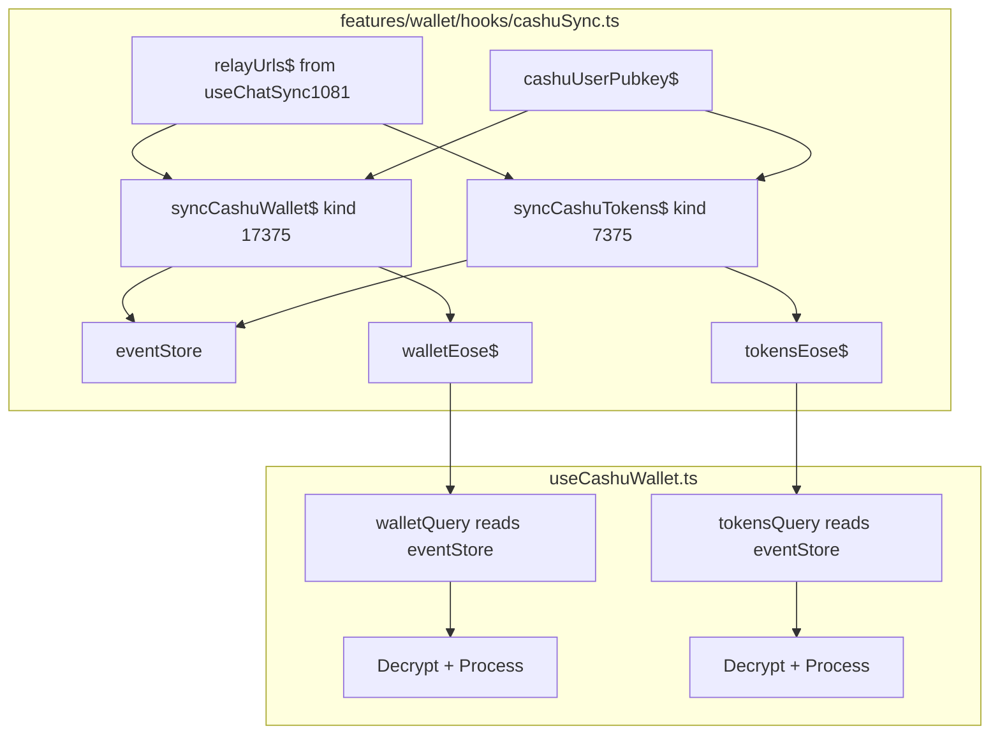

# Cashu Wallet Migration to Applesauce Pattern

## Goal
Migrate `nostr.query()` calls in [`useCashuWallet.ts`](../features/wallet/hooks/useCashuWallet.ts:94) to use the applesauce pattern from [`useChatSync1081.ts`](../hooks/useChatSync1081.ts:362).

## Current State
Two `nostr.query()` calls:
1. **Wallet query** (kind 17375) - line 94-95
2. **Tokens query** (kind 7375) - line 351

Both use manual timeout handling with `Promise.race`.

## Target Architecture



---

## Implementation

### File 1: `features/wallet/hooks/cashuSync.ts` (NEW)

```typescript
/**
 * Cashu wallet sync using applesauce pattern
 * Compact, reactive event fetching for NIP-60 wallet events
 */
import {
  BehaviorSubject,
  combineLatest,
  filter,
  switchMap,
  tap,
  EMPTY,
  catchError,
  shareReplay,
  distinctUntilChanged,
  map,
  from,
  mergeMap,
} from "rxjs";
import { relayUrls$ } from "@/hooks/useChatSync1081";
import { eventStore, relayPool } from "@/lib/applesauce-core";
import { CASHU_EVENT_KINDS } from "@/lib/cashu";
import { onlyEvents } from "applesauce-relay";
import type { NostrEvent } from "nostr-tools";

// Debug toggle
const DEBUG = false;
const log = (...args: unknown[]) => DEBUG && console.log("[cashuSync]", ...args);

// User pubkey for cashu sync
export const cashuUserPubkey$ = new BehaviorSubject<string | null>(null);

// Derive filtered streams
const pubkeyDefined$ = cashuUserPubkey$.pipe(
  filter((p): p is string => p !== null),
  distinctUntilChanged(),
  shareReplay(1)
);

const relaysDefined$ = relayUrls$.pipe(
  filter((urls): urls is string[] => urls.length > 0),
  distinctUntilChanged((a, b) => a.length === b.length && a.every((u, i) => u === b[i])),
  shareReplay(1)
);

// EOSE tracking
export const walletEose$ = new BehaviorSubject<boolean>(false);
export const tokensEose$ = new BehaviorSubject<boolean>(false);

// Sync wallet events (kind 17375) - replaceable, fetch latest
export const syncCashuWallet$ = combineLatest([pubkeyDefined$, relaysDefined$]).pipe(
  tap(() => walletEose$.next(false)),
  switchMap(([pubkey, relays]) => {
    log("Syncing wallet for", pubkey.slice(0, 8), "on", relays.length, "relays");
    return relayPool
      .subscription(relays, { kinds: [CASHU_EVENT_KINDS.WALLET], authors: [pubkey], limit: 1 })
      .pipe(
        mergeMap((value: unknown) => {
          if (value === "EOSE") {
            log("Wallet EOSE");
            walletEose$.next(true);
            return EMPTY;
          }
          return from([value as NostrEvent]);
        }),
        filter((e): e is NostrEvent => typeof e === "object" && e !== null && "id" in e),
        tap((e) => {
          log("Wallet event:", e.id.slice(0, 8));
          eventStore.add(e);
        }),
        catchError((err) => {
          console.error("[cashuSync] Wallet sync error:", err);
          walletEose$.next(true);
          return EMPTY;
        })
      );
  }),
  shareReplay(1)
);

// Sync token events (kind 7375)
export const syncCashuTokens$ = combineLatest([pubkeyDefined$, relaysDefined$]).pipe(
  tap(() => tokensEose$.next(false)),
  switchMap(([pubkey, relays]) => {
    log("Syncing tokens for", pubkey.slice(0, 8));
    return relayPool
      .subscription(relays, { kinds: [CASHU_EVENT_KINDS.TOKEN], authors: [pubkey], limit: 100 })
      .pipe(
        mergeMap((value: unknown) => {
          if (value === "EOSE") {
            log("Tokens EOSE");
            tokensEose$.next(true);
            return EMPTY;
          }
          return from([value as NostrEvent]);
        }),
        filter((e): e is NostrEvent => typeof e === "object" && e !== null && "id" in e),
        tap((e) => {
          log("Token event:", e.id.slice(0, 8));
          eventStore.add(e);
        }),
        catchError((err) => {
          console.error("[cashuSync] Token sync error:", err);
          tokensEose$.next(true);
          return EMPTY;
        })
      );
  }),
  shareReplay(1)
);

// Combined ready state
export const cashuSyncReady$ = combineLatest([walletEose$, tokensEose$]).pipe(
  map(([w, t]) => w && t),
  distinctUntilChanged(),
  shareReplay(1)
);

// Helper to get events from store
export const getCashuWalletEvents = (pubkey: string) =>
  eventStore.getByFilters({ kinds: [CASHU_EVENT_KINDS.WALLET], authors: [pubkey] });

export const getCashuTokenEvents = (pubkey: string) =>
  eventStore.getByFilters({ kinds: [CASHU_EVENT_KINDS.TOKEN], authors: [pubkey] });
```

---

### File 2: `features/wallet/hooks/useCashuWallet.ts` (MODIFIED)

Key changes only - rest of file unchanged:

**Add imports at top:**
```typescript
import { useEffect, useRef } from "react";
import {
  cashuUserPubkey$,
  syncCashuWallet$,
  syncCashuTokens$,
  walletEose$,
  tokensEose$,
  getCashuWalletEvents,
  getCashuTokenEvents,
} from "./cashuSync";
import { eventStore } from "@/lib/applesauce-core";
```

**Remove `useNostr` import and usage** - no longer needed for queries.

**Add sync activation in hook body:**
```typescript
// Activate cashu sync when user changes
useEffect(() => {
  if (user?.pubkey) {
    cashuUserPubkey$.next(user.pubkey);
    const sub1 = syncCashuWallet$.subscribe();
    const sub2 = syncCashuTokens$.subscribe();
    return () => {
      sub1.unsubscribe();
      sub2.unsubscribe();
    };
  }
}, [user?.pubkey]);
```

**Replace walletQuery queryFn (lines 88-254):**
```typescript
queryFn: async () => {
  if (!user) return null;

  // Wait for EOSE or timeout
  const waitForEose = () =>
    new Promise<void>((resolve) => {
      if (walletEose$.getValue()) return resolve();
      const sub = walletEose$.pipe(filter(Boolean)).subscribe(() => {
        sub.unsubscribe();
        resolve();
      });
      setTimeout(() => {
        sub.unsubscribe();
        resolve();
      }, 10000);
    });

  await waitForEose();

  const events = getCashuWalletEvents(user.pubkey);
  
  if (events.length === 0) {
    setShowQueryTimeoutModal(false);
    setDidRelaysTimeout(false);
    localStorage.setItem("cashu_relays_timeout", "false");
    return null;
  }

  // Sort by created_at descending to get latest (replaceable event)
  const event = events.sort((a, b) => b.created_at - a.created_at)[0];

  // ... KEEP ALL EXISTING DECRYPTION LOGIC FROM LINE 135 ONWARDS ...
  // Starting from: if (!user.signer.nip44) { ...
```

**Replace getNip60TokensQuery queryFn (lines 329-491):**
```typescript
queryFn: async () => {
  if (!user) return [];

  // Wait for EOSE or timeout
  const waitForEose = () =>
    new Promise<void>((resolve) => {
      if (tokensEose$.getValue()) return resolve();
      const sub = tokensEose$.pipe(filter(Boolean)).subscribe(() => {
        sub.unsubscribe();
        resolve();
      });
      setTimeout(() => {
        sub.unsubscribe();
        resolve();
      }, 15000);
    });

  await waitForEose();

  const events = getCashuTokenEvents(user.pubkey);

  if (events.length === 0) {
    setShowQueryTimeoutModal(false);
    setDidRelaysTimeout(false);
    localStorage.setItem("cashu_relays_timeout", "false");
    return [];
  }

  // ... KEEP ALL EXISTING DECRYPTION/PROCESSING LOGIC FROM LINE 378 ONWARDS ...
  // Starting from: const nip60TokenEvents: Nip60TokenEvent[] = [];
  // But replace `for (const event of events)` loop source with the `events` variable above
```

---

## Summary of Changes

| File | Action | Lines Changed |
|------|--------|---------------|
| `features/wallet/hooks/cashuSync.ts` | CREATE | ~100 lines |
| `features/wallet/hooks/useCashuWallet.ts` | MODIFY | ~50 lines changed |

## Benefits
1. **Consistent pattern** with useChatSync1081
2. **Event caching** via eventStore - faster subsequent loads
3. **EOSE-aware** - waits for relay sync before processing
4. **Reactive updates** - new events automatically stored
5. **Minimal code** - clean separation of concerns
6. **No nostr.query** - uses applesauce relayPool.subscription
